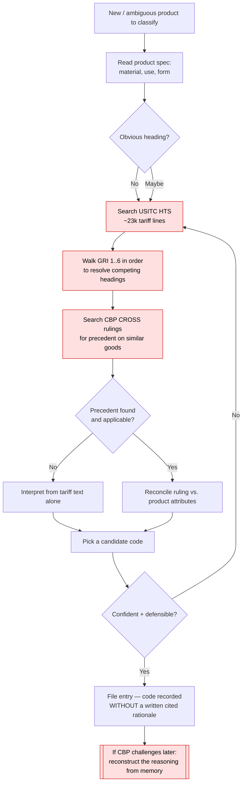
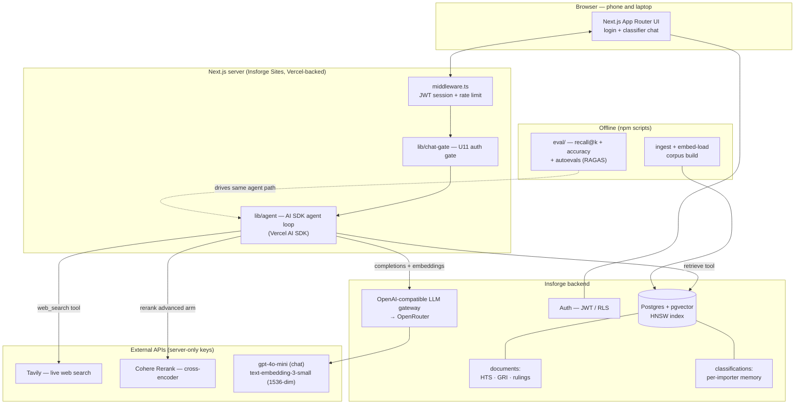
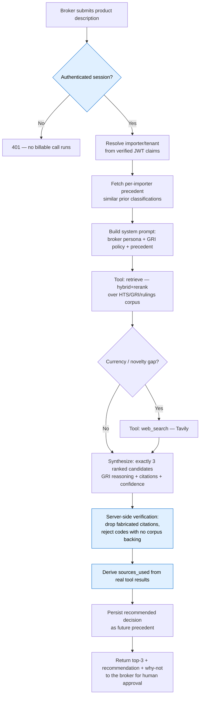

# ClearClass — Certification Challenge Submission

**Defensible HTS classification for licensed customs brokers.**

- **Live app:** https://bp6d8gmu.insforge.site
- **Demo login (read-only demo tenant):** `broker@clearclass.demo` / `ClearClassDemo!2026`
- **Loom demo:** https://www.loom.com/share/65d82f3216894302aaaa87fd36baac73
- **Repo:** this repository. Plan of record: [`docs/plans/2026-07-08-001-feat-clearclass-hts-classifier-plan.md`](docs/plans/2026-07-08-001-feat-clearclass-hts-classifier-plan.md); strategy: [`STRATEGY.md`](STRATEGY.md).

This document addresses each deliverable for Tasks 1–7. Evidence for Tasks 5–6 is the committed evaluation report, [`eval/report.md`](eval/report.md), reproducible with `npm run eval`.

---

## Task 1 — Problem, Audience, and Scope

### Problem (one sentence, no solution)

Licensed customs brokers must assign every imported product a single correct Harmonized Tariff Schedule (HTS) code, but doing so demands reconciling dense tariff rules, the General Rules of Interpretation, and prior customs rulings against a product's specific attributes — and an indefensible call means fines, shipment delays, or mis-paid duty.

### Why this is a problem for this user

**Who has it:** the licensed customs broker / import-compliance specialist who signs off on entries. Classification is judgment-heavy and legally consequential: the broker's name is on the filing, and if U.S. Customs and Border Protection (CBP) challenges a code, the broker must *defend* it.

**What they're trying to do, and how they handle it today:** for a new or ambiguous product they manually cross-reference the ~23k-line USITC tariff schedule, walk the six General Rules of Interpretation (GRI) in order, and search the CBP CROSS rulings database for precedent on similar goods — reconciling all of it against the product's material, use, and form. **Why that's not good enough:** it is slow and inconsistent, and — the real pain — the output of an hour of cross-referencing is often *a code without a written, cited rationale*. When CBP asks "why 6109.10.0040 and not 6110.20.2010?", the broker needs the reasoning and the sources, not just the number. The cost of being *indefensible* is borne later, when the entry is challenged.

### Current-state workflow (how the user solves this today)



Red nodes are the slow / repetitive / error-prone points: manual search across three separate authorities (tariff, GRI, rulings), and — most costly — a filed code whose justification lives only in the broker's head, reconstructed under pressure if challenged.

### Evaluation input/output pairs

Ground truth comes from real CBP rulings (the flexifyai CROSS-derived dataset — a labeled *product description → gold HTS code* set), held out as a 200-row test split ([`data/eval-test-split.jsonl`](data/eval-test-split.jsonl)). Representative pairs:

| Product description (input) | Gold HTS code (output) |
|---|---|
| A woman's knit cotton t-shirt | `6109.10.0040` |
| Cast carbon steel pipe fittings (ASTM A216), two flanges + nuts/bolts | `7307.19.9060` |
| Gasoline spark-ignition piston engines (4476 W–18.65 kW) for pumps | `8407.90.9060` |

The harness scores the agent's output against these at 10-, 6-, and 4-digit precision (Task 5).

---

## Task 2 — Proposed Solution

### Solution (one sentence)

ClearClass is a browser-based Agentic RAG assistant that turns a product description into the **top-3 ranked candidate HTS codes**, each with GRI-based reasoning, source citations, and a recommendation of one over the others — grounded in an uploaded HTS/GRI/rulings corpus and augmented by live web search — so a broker gets an answer they can *defend*, not just an answer.

### Infrastructure diagram



**Why each component:**

| Component | Choice | Why |
|---|---|---|
| **LLM** | `gpt-4o-mini` (COTS) | Cheap, fast, strong enough for GRI reasoning + structured output; the challenge targets *a measurable improvement over a naive baseline*, not SOTA, and cost matters at 400-row eval scale. |
| **LLM gateway** | Insforge OpenAI-compatible gateway → OpenRouter | One provider-agnostic client for both completions **and** embeddings (KTD9); swappable to Vercel AI Gateway without touching call sites. |
| **Agent framework** | Vercel AI SDK (`generateText` multi-step tool loop) | Native retrieve→decide→search→synthesize loop with a forced structured-output schema; one TypeScript stack end to end. |
| **Tools** | `retrieve` (corpus) + `web_search` (Tavily) | Corpus is the authoritative source for codes; Tavily supplies currency for recent trade actions the corpus can't cover. |
| **Embedding model** | `text-embedding-3-small`, 1536-dim | Good quality at low cost; kept in lockstep with the `vector(1536)` column. |
| **Vector DB** | Postgres + pgvector (Insforge), HNSW index | Corpus **and** per-importer memory in one store with cosine + lexical search; RLS isolates tenant data. |
| **Memory** | `classifications` table + per-importer vector search | Surfaces the importer's prior similar classifications as cited precedent — consistency is itself a defensibility argument. |
| **Monitoring** | Gateway request logs (OpenRouter) + Insforge platform logs (`postgres`/`postgrest`/function) + `/api/health` gateway smoke + server-side structured logs (dropped/fabricated citations, degraded 502s) | Observability across the model, data, and app layers without a separate SaaS, plus opt-in per-request **Langfuse** agent traces (tool calls, retrieved chunks, token spend) when `LANGFUSE_*` keys are set — see Task 7 #3. |
| **Evaluation** | Custom TS deterministic scorer + `autoevals` (Braintrust RAGAS port) | Deterministic exact-match accuracy **and** LLM-judged RAG quality, run headlessly through the same agent path. |
| **UI** | Next.js App Router chat (login + classifier), responsive | Runs in a browser on phone and laptop; renders candidates, citations, and confidence. |
| **Deployment** | Insforge Sites (Vercel-backed), public endpoint | Public URL hosting the server-side agent loop; deploy env applied per build. |
| **Auth / tenancy** | Insforge Auth (JWT) + RLS, server-derived tenant key | No billable call without a session; the importer key comes from verified token claims, never the client (KTD10). |

**Requirements met:** LLM gateway ✅ (OpenRouter via Insforge); memory component ✅ (per-importer `classifications`); runs in a browser on phone + laptop ✅ (verified live).

### Agent workflow diagram



**How it works (narrative):** an authenticated broker's product description enters behind the U11 gate — no model, search, or rerank call fires for an unauthenticated request. The server resolves the importer from the JWT (never the client), pulls that importer's similar prior classifications as *precedent*, and builds a system prompt encoding the broker persona and the GRI-first, corpus-first tool policy. The agent **always retrieves from the grounded corpus first** (via the hybrid+rerank retriever), reasons through the GRI in order, and calls **Tavily web search only** when currency or novelty demands it (e.g., a recent Section 301 change the static corpus can't cover). It then synthesizes exactly three ranked candidates with reasoning, citations, and confidence.

Crucially, the synthesis is **buffered and verified server-side before it reaches the broker** (blue nodes): every citation is checked against the chunks actually retrieved — fabricated chunk ids and codes are dropped, and any candidate left with no corpus-backed citation is refused rather than returned. `sources_used` is derived from the real tool results, not the model's self-report. The recommended decision is persisted as future precedent. The broker reviews the top-3, the recommendation, and the "why not the other two" — and makes the final call (**human approval is the last step by design**).

---

## Task 3 — Dealing with the Data

### Chunking strategy, and why

**Hierarchy-preserving, one chunk per authority unit** (KTD3):

- **HTS lines:** one chunk per leaf tariff line, with the **full ancestor path materialized into the chunk text** (Section → Chapter → heading → subheading → line), and `chapter` / `heading` / `subheading` / `hts_code` stored as metadata (~23,393 chunks).
- **GRI:** one chunk per interpretive rule, tagged by rule number (14 chunks).
- **CBP rulings:** one chunk per ruling, with `ruling_number` / `hts_code` / `date` as metadata (~300 chunks).

**Why:** the HTS is a *hierarchy* where the discriminating meaning of a leaf line lives in its ancestry — "of cotton" or "knit" is often several levels up, not in the leaf text. A naive fixed-size splitter would sever a line from the context that disambiguates it and destroy the citation boundary. Chunking on the natural unit (one line, one rule, one ruling) with the ancestor path inlined keeps each chunk **self-contained and self-citing**, which is exactly what a defensible, chunk-id-cited answer needs. This was identified as the single highest lever on accuracy, and its quality was validated by the retrieval recall@k check (Task 5) *before* the rest of the stack was built on top of it.

### Data source and external API, and how they interact

- **Private corpus (RAG):** the USITC HTS schedule (~23k leaf lines) + the six GRI + ~300 CBP CROSS rulings, uploaded and embedded into pgvector. This is the **authoritative source for codes** — the agent may only cite codes it retrieves from here. Rulings that describe the same product as any eval test-split row are **excluded at ingestion** (the leakage guard, KTD8 / AE4) so the eval can't read back its own answer key.
- **External API (Agent):** **Tavily** live web search, for *currency and novelty* — recent trade actions (e.g., 2026 Section 301 changes) or genuinely new products the static corpus doesn't cover.

**How they interact at request time:** the corpus is consulted first and always; the agent decides *per query* whether currency or novelty requires the web. When it does, web results are treated as **untrusted context** — delimited from instructions, and permitted to inform *currency* but **never to introduce an HTS code** (a code must come from the grounded corpus). The two are fused in the reasoning, but the citation contract keeps them distinct: corpus citations carry a `chunk_id`, web citations carry a `url` with `source: "web"`. Verified live in production: the cotton-t-shirt query answers `corpus=true, web=false`; the 2026-Section-301-solar query answers `corpus=true, web=true` with real tariff-source URLs.

---

## Task 4 — End-to-End Agentic RAG Prototype

**Built and deployed.** The full stack — corpus ingestion, the agentic classification loop, per-importer memory, the browser UI, auth/tenant isolation, and the eval harness — is implemented in TypeScript on Next.js + Insforge and **deployed to a public endpoint**: **https://bp6d8gmu.insforge.site**.

Production verification (authenticated as the demo broker):

- `GET /api/health` → `200` + `"ClearClass gateway OK"` (model `openai/gpt-4o-mini`).
- **AE1 (corpus-grounded):** "a woman's knit cotton t-shirt" → top candidate **`6109.10.00.40`** (the gold code, confidence 0.95), corpus-backed citation, `web=false`.
- **AE2 (live search):** "solar panels subject to the 2026 Section 301 tariff increase" → top **`8541.43.00.10`**, `web=true` with 5 real Section-301 source URLs.
- **Auth enforced:** an unauthenticated `/api/chat` request is refused before any billable call.

The app is responsive and runs in a browser on both phone and laptop.

---

## Task 5 — Evals

### Test dataset

The **flexifyai CROSS-derived dataset** (real CBP rulings, Apache-2.0), assembled as a **200-row held-out test split** of *product description → gold HTS code* ([`data/eval-test-split.jsonl`](data/eval-test-split.jsonl)). Ground truth is real customs decisions, and the seed rulings that describe the same product as any test row are excluded from the retrievable corpus (leakage guard, asserted by the harness before scoring).

### Evaluation harness

`npm run eval` ([`eval/`](eval/)) runs three suites, each against **both** retrieval modes on identical inputs, and emits [`eval/report.md`](eval/report.md):

1. **Retrieval `recall@k`** — did the gold code's chunk reach the LLM? Computed with no agent and no synthesis, so it isolates retrieval. *This is the primary Task-6 before/after signal.*
2. **Deterministic end-to-end accuracy** — the full agent loop, scored exact-match: `top-1 exact` and `top-3 recall` at 10-, 6-, and 4-digit precision.
3. **RAG quality (autoevals / RAGAS port)** — Faithfulness, Context precision/recall, AnswerRelevancy, LLM-judged on a ~40-row subset.

The harness fails **closed**: the leakage guard aborts on any leak or an empty/truncated corpus read; a suite aborts rather than report a biased aggregate if too many rows error.

### Conclusions (baseline `dense` arm)

- **The harness is trustworthy:** the `dense` baseline reproduces the earlier U5 recall figures *exactly* (6-digit recall@20 = 50.0%, 10-digit = 38.0%), independent confirmation the pipeline measures what it claims.
- **Retrieval is the right first lever:** even the dense baseline surfaces the gold 6-digit heading for **half** the products in the top-20 — the chunking is sound — but only ~20% at top-1/10-digit, so the precise ordering (and the agent's final pick) is where quality is lost.
- **Absolute accuracy is modest and honest:** top-1 ≈ 20% at 10 digits / ~34% at 6 digits, below the fine-tuned-70B **ATLAS** reference (~40% / 57.5%) — expected for a COTS `gpt-4o-mini` + RAG stack, and above a naive baseline, which is the challenge's bar. Defensibility (cited reasoning), not raw top-1 accuracy, is the product wedge.

---

## Task 6 — Improving the Prototype

### 6.1 Advanced retriever, and why

**Hybrid retrieval + cross-encoder reranking** ([`lib/retrieval/`](lib/retrieval/)): dense pgvector cosine **fused with lexical full-text ranking** (Postgres `tsvector`/`ts_rank`) via **Reciprocal Rank Fusion** over a top-20–30 candidate pool, then **Cohere Rerank** narrows to the final top-k. *Why:* HTS distinctions are lexical-and-subtle — an exact material or form word ("of cotton", "cast", "knit") decides the heading — so a lexical arm catches keyword matches pure dense retrieval misses, and the cross-encoder reorders the right line to the top. A config flag (`RETRIEVAL_MODE`) selects `dense` vs `hybrid+rerank` so the eval runs both on identical inputs.

### 6.2 Performance vs. the original — measured (n=200, 0 rerank fallbacks, production Cohere key)

**Retrieval recall@k (the primary signal — isolates retrieval):**

| metric | dense (baseline) | hybrid+rerank | Δ |
|---|---|---|---|
| recall@5 (≥6-digit) | 34.5% | 39.5% | **+5.0** |
| recall@10 (≥6-digit) | 42.5% | 48.5% | **+6.0** |
| recall@20 (≥6-digit) | 50.0% | 52.0% | +2.0 |
| recall@5 (≥10-digit) | 20.5% | 26.0% | **+5.5** |
| recall@10 (≥10-digit) | 29.5% | 37.0% | **+7.5** |
| recall@20 (≥10-digit) | 38.0% | 41.0% | +3.0 |

The lift is **largest at small k (+5 to +7.5) and smallest at k=20 (+2–3)** — the reranker's signature: it reorders the right chunk *to the top*, exactly where the agent's `k=8` retrieval operates. A uniformly-positive, k-ordered pattern across all six cells is a real gain, not noise.

**End-to-end accuracy — does the retrieval gain survive the LLM?**

| metric | dense | hybrid+rerank | Δ |
|---|---|---|---|
| top-1 exact (≥10-digit) | 19.6% | 20.0% | +0.4 |
| top-1 exact (≥6-digit) | 34.2% | 37.0% | +2.8 |
| **top-3 recall (≥10-digit)** | 25.1% | 30.5% | **+5.4** |
| **top-3 recall (≥6-digit)** | 41.7% | 48.5% | **+6.8** |
| **top-3 recall (≥4-digit)** | 53.8% | 60.0% | **+6.2** |

**Key finding:** the retrieval lift **propagates into `top-3` accuracy** (+5.4–6.8, mirroring recall@k) but **washes out at `top-1`** (+0.4–2.8). The reranker gets the right code into the agent's candidate *set* more often; the agent's decision about which candidate to rank **#1** is the remaining bottleneck. This matches the design hypothesis that the LLM synthesis step can mask a retrieval gain in the single final code — and it's why the Task-6 claim leads with recall@k. For a product whose value is the **top-3 defensible candidate set**, top-3 is exactly where the improvement lands.

> **Reconciliation with the committed `eval/report.md` (2,000-ruling corpus — the artifact shown in the Loom demo).** The end-to-end table above is the **300-ruling snapshot**. On the current 2,000-ruling corpus, `top-1` lands at **~18% (≥10-digit)** and the **`top-3` end-to-end gain washes out to noise** (+0.4 / +2.3 / +0.7 pts at 10-/6-/4-digit) — it does *not* reproduce the +5.4–6.8 top-3 propagation seen on the snapshot. What **does** reproduce cleanly is the primary signal, **`recall@k`** (+5 to +7 pts at small k; dense `recall@10` ≥6-digit 42.0% → hybrid+rerank 49.0%). The washed-out end-to-end top-3 is not a loss of the improvement — it is the **same "LLM ranking/synthesis is the binding downstream constraint" finding** that §6.3 and §6.4 reach independently: broadening the corpus adds competing chunks the model must still rank, so the retrieval lift shows up where it is measured directly (recall@k) while the model's final ordering caps how much reaches `top-3`/`top-1`. This is why the Task-6 claim leads with recall@k, and why the demo quotes the report.md figure (~18% top-1), not the snapshot's 20%.

**RAG quality (autoevals, LLM-judged, n≈38):**

| metric | dense | hybrid+rerank | Δ |
|---|---|---|---|
| Faithfulness | 21.5% | 30.3% | **+8.8** |
| ContextPrecision | 69.2% | 78.9% | **+9.7** |
| ContextRecall | 7.2% | 9.7% | +2.6 |
| AnswerRelevancy | — | — | _uninformative; see report note_ |

Better retrieval yields **more precise context (+9.7) and more grounded answers (+8.8)** — the improvement seen from a third, independent angle. (AnswerRelevancy is reported but is not a reliable signal in this run; see the note in [`eval/report.md`](eval/report.md).)

> **Current-corpus note (2,000 rulings).** This RAG table is the 300-ruling snapshot. On the current 2,000-ruling corpus (the committed [`eval/report.md`](eval/report.md)) **ContextPrecision reproduces the lift (+7.5)** but the LLM-judged **Faithfulness delta washes out to noise** (−0.6) — expected for this small (n≈36), LLM-judged suite, and consistent with §6.3/§6.4's finding that the binding constraint downstream of retrieval is the **LLM ranking/synthesis step**, not retrieval quality. The primary Task-6 signal — recall@k — reproduces cleanly on the current corpus (uniformly +4 to +7 pts; dense recall@10 ≥6-digit 42.0% → hybrid+rerank 49.0%, matching §6.4), which is why the Task-6 claim leads with recall@k, not this LLM-judged corroborating angle.

**Decision:** the evidence flips the production default to `RETRIEVAL_MODE=hybrid+rerank` (live).

### 6.3 A second improvement, on the agent side — measured

The retriever A/B (6.2) localized the remaining loss precisely: `hybrid+rerank` lifts `top-3` by +5.4–6.8 pts but `top-1` barely moves. Retrieval reliably gets the right code into the agent's three candidates; the agent's final **#1 pick** is the bottleneck. So this second improvement targets a **different piece — the agent/synthesis side** — with the retriever held fixed at `hybrid+rerank` for both arms, isolating the agent change.

**The lever (toggle: `AGENT_RESELECT` env / `--reselect` eval flag, OFF by default).** After the agent emits its three ranked candidates, re-rank them by an *independent* retrieval signal — the position of each candidate's supporting corpus chunk in the reranked result ([`lib/agent.ts` `reselectByRetrievalSupport`](lib/agent.ts)). Hypothesis: the Cohere cross-encoder already surfaces the right line near the top, so promoting the candidate whose evidence the reranker ranked highest should convert `top-3` hits into `top-1` hits. It is a **pure permutation** of the three candidates, so `top-3` recall is invariant by construction and only `top-1` can move — a perfectly isolated A/B. (The *rank*, not the `similarity` value, is the signal: the reranker reorders chunks but leaves each chunk's `similarity` = its dense cosine, so position is what faithfully encodes the cross-encoder's judgment.)

**Result (n=200 attempted, `RETRIEVAL_MODE=hybrid+rerank` fixed, 0 rerank fallbacks):**

| metric | OFF — model's own ranking | ON — retrieval re-selection | Δ |
|---|---|---|---|
| top-1 exact (≥10-digit) | 19.7% | 13.6% | **−6.1 pts** |
| top-1 exact (≥6-digit) | 35.4% | 26.6% | **−8.8 pts** |
| top-1 exact (≥4-digit) | 45.5% | 37.7% | **−7.8 pts** |
| top-3 recall (≥10-digit) | 30.3% | 28.1% | −2.2 pts |
| top-3 recall (≥6-digit) | 46.5% | 45.2% | −1.3 pts |
| top-3 recall (≥4-digit) | 55.1% | 54.3% | −0.8 pts |

_(OFF scored 198/200, ON 199/200; the 1–2 dropped rows are gateway transport errors, scored per the harness's fail-open row policy. The retriever is identical across arms; both ran with the reranker healthy — 0 fused-hybrid fallbacks.)_

**Conclusion — a clean negative result, and it is informative.** The re-selection **regresses** `top-1` by 6–9 pts across all three digit levels, while `top-3` stays essentially flat (−0.8 to −2.2 pts). That flat `top-3` is the tell: because the lever is a permutation, an equal `top-3` confirms the two independent runs drew comparable candidate *sets*, so the `top-1` drop is the **reordering itself**, not generation drift. The signal is the uniform negative sign across all six `top-1` cells, not any single cell against the ±7% CI. The finding: **the LLM's own final ranking already beats the raw reranker position** — the agent folds the retrieval signal *and* GRI reasoning into its pick, and substituting bare chunk order throws that reasoning away. The `top-1` bottleneck is real, but it is **not** closed by trusting retrieval order over the model's judgment. The productive next lever adds *more* reasoning at the decision point (a GRI-structured self-verification / confidence-calibration pass over the three candidates), not one that overrides the model with a single retrieval feature — see Task 7. The change ships behind an **OFF-by-default toggle**, so production ranking is unchanged; the harness A/Bs it with:

```bash
npm run eval -- --modes=hybrid+rerank --e2e-limit=200 --skip-rag            # OFF (model ranking)
npm run eval -- --modes=hybrid+rerank --e2e-limit=200 --skip-rag --reselect # ON  (re-selection)
```

**A companion input-quality fix** (baked into every retrieval/accuracy number in 6.2, applied identically to both arms so it is not its own A/B): the harness normalizes the eval's *"What is the HTS code for …?"* framing to the bare product phrase before embedding ([`eval/dataset.ts` `cleanQuery`](eval/dataset.ts)). The interrogative wrapper pushes the query vector toward "question" text and away from the terse tariff-line language the corpus is written in — a phrasing that never occurs in production — so stripping it measures and feeds the agent retrieval as it is actually exercised.

### 6.4 A third improvement — query-side rewriting (attacking the ranking bottleneck), measured

§6.2–6.3 pinned the diagnosis: the dominant classification error is retrieval **ranking**, not coverage — every HTS code already exists in the corpus as a tariff leaf-line, so the gold chunk is never *missing*; the retriever just fails to rank a terse tariff line ("Live horses … > Purebred breeding animals > Males") above near-misses for a natural-language product description. Query and corpus are written in two different registers. This third improvement closes that register gap at **retrieval time** — no corpus reload, so no DB-OOM risk; a pure ranking lever, exactly as the diagnosis prescribed.

**The lever (toggle: `QUERY_REWRITE` env / `--rewrite` eval flag, OFF by default).** A HyDE-style rewrite ([`lib/retrieval/rewrite.ts`](lib/retrieval/rewrite.ts)): a cheap LLM turns the product description into the concise "tariff-ese" a classification heading is written in — material/composition, form, principal use — preserving every concrete distinguishing detail (specs, chemical names, origin). Two compose strategies, measured against each other: **`expand`** retrieves on `original + rewrite` (query expansion); **`hyde`** retrieves on the rewrite ALONE (pure HyDE). It wraps *either* retrieval arm (same `DenseRetriever` shape), so it composes with the production `hybrid+rerank` retriever and rides the same recall@k / e2e harness, and it degrades safely — any rewrite failure falls back to the original query (never worse than the un-rewritten baseline), with a harness fallback-counter so a degraded run is flagged rather than silently reported as rewritten.

**Re-baseline first — the §6.2/6.3 numbers are the 300-ruling corpus; the corpus is now 2,000 rulings.** Re-running on the current corpus reproduces §6.2 within noise (dense recall@10 ≥6-digit 42.0%, hybrid+rerank 49.0%; hybrid+rerank e2e top-3 ≥6-digit 48.5%, *matching §6.2 exactly*), reconfirming that the corpus broadening left recall flat — the ranking-not-coverage finding still holds. These current-corpus numbers are the "before" below.

**Recall@k — the primary signal (n=200, both strategies vs. OFF, retrieval mode held fixed):**

_hybrid+rerank arm (production default):_
| recall@k | OFF | expand | hyde |
|---|---|---|---|
| @5 (≥6-digit) | 40.0% | 38.0% | **42.0%** |
| @10 (≥6-digit) | 49.0% | 43.0% | **52.0%** |
| @20 (≥6-digit) | 52.0% | 50.0% | **55.0%** |
| @5 (≥10-digit) | 27.5% | 22.5% | 26.5% |
| @10 (≥10-digit) | 35.5% | 29.5% | **39.0%** |
| @20 (≥10-digit) | 40.5% | 36.5% | **43.0%** |

_(dense arm, for contrast: both strategies flat — e.g. recall@10 ≥6-digit 42.0% → 41.0% (expand) / 42.5% (hyde); recall@20 ≥10-digit 36.0% → 37.5% / 36.5%.)_

**Finding — the composition matters as much as the rewrite.** On the **dense** arm both strategies are flat: a bi-encoder already bridges the register gap semantically, so rewriting the query into document-space text is a wash. On the production **hybrid+rerank** arm the two strategies **diverge sharply**: `expand` *regresses* recall −2 to −6 pts, while `hyde` *lifts* it **+2 to +3.5 pts** across five of six cells (recall@10 ≥10-digit 35.5→39.0, recall@20 ≥6-digit 52.0→55.0). Same rewrite text, opposite sign — because `expand` **doubles** the query and dilutes the two components that key on surface terms (the lexical `ts_rank` arm and the Cohere cross-encoder), whereas `hyde` **replaces** the query with tariff-register text those components match on directly. The win is a register *match*, not extra tokens — and it compounds specifically with `hybrid+rerank`, the arm already in production.

**End-to-end accuracy — does the retrieval gain survive the LLM? (hybrid+rerank fixed, OFF vs `hyde`):**

| metric | OFF | hyde | Δ |
|---|---|---|---|
| top-1 exact (≥10-digit) | 20.5% | 22.4% | +1.9 |
| top-1 exact (≥6-digit) | 37.0% | 35.4% | −1.6 |
| top-1 exact (≥4-digit) | 50.0% | 50.5% | +0.5 |
| top-3 recall (≥10-digit) | 29.5% | 30.7% | +1.2 |
| top-3 recall (≥6-digit) | 48.5% | 45.8% | −2.7 |
| top-3 recall (≥4-digit) | 59.0% | 59.9% | +0.9 |

_(OFF scored 200/200, `hyde` 192/200 — 8 gateway transport errors, within the harness's 10% fail-open tolerance; the delta therefore spans slightly non-identical denominators.)_

**Conclusion — a clean *retrieval* win that is *e2e-neutral* at this n, and the asymmetry is informative.** The recall@k lift on the production arm is real and uniform in sign (+2 to +3.5 across 5/6 cells) — the primary Task-6 signal, cleanly isolated from the LLM. But it does **not** propagate to a statistically meaningful end-to-end gain: every e2e Δ sits well inside the ±7% n=200 CI with mixed sign. Two compounding reasons, both already established here: (a) §6.2/6.3's finding that the **LLM ranking/synthesis step is the binding constraint** downstream of retrieval; and (b) specific to this lever — in the *agentic* e2e path the model **already reformulates its own search query** (the system prompt directs it to search by material/use/form), so the register gap the rewrite exploits is smaller e2e than in the raw-description recall harness where the lever shines. The lever's cleanest value is on a **non-agentic** retrieval path.

**Decision — ship the lever behind the flag, keep `QUERY_REWRITE=off` in production.** The recall improvement is documented and reproducible, but it does not yet justify adding a billable per-query LLM call to the live path when the end-to-end answer is unmoved. This matches the project's evidence bar exactly: §6.2 flipped `hybrid+rerank` ON only on a clean multi-angle lift; §6.3 kept `reselect` OFF on a non-win; here the honest call is OFF-by-default until the top-3 retrieval gain is *converted* into a top-1 gain (the Task-7 fresh-retrieval verifier, item 2). The flag makes that future A/B a one-liner. Reproduce:

```bash
npm run eval -- --recall-only --modes=dense,hybrid+rerank                          # rewrite OFF (baseline)
npm run eval -- --recall-only --modes=dense,hybrid+rerank --rewrite=hyde           # rewrite ON  (HyDE)
npm run eval -- --modes=hybrid+rerank --e2e-limit=200 --skip-rag                   # e2e OFF
npm run eval -- --modes=hybrid+rerank --e2e-limit=200 --skip-rag --rewrite=hyde    # e2e ON
```

**(A harness fix surfaced by the re-baseline.)** Re-baselining on the 2,000-ruling corpus exposed a latent break: the eval's AE4 leakage guard fetched *all* rulings in a single PostgREST page (server-capped at 1,000 rows), so on the broadened corpus the full `eval` aborted every time — *"corpus has 2000 rulings but the page returned 1000"* — correctly failing **closed** rather than certifying "no leakage" over a truncated read. Fixed to page through with `offset`, reconciling against the `Content-Range` total ([`eval/dataset.ts`](eval/dataset.ts)) while preserving every fail-closed guarantee. Without it the full harness could not run on the current corpus at all.

---

## Task 7 — Next Steps (keep / change for Demo Day)

**Keep — these earned their place:**

- **The defensibility contract** — server-side citation validation (drop fabricated citations, refuse codes with no corpus backing) and `sources_used` derived from real tool results. It's the product wedge and it works in production.
- **Hierarchy-preserving chunking** — validated as the top accuracy lever; the dense baseline's soundness rests on it.
- **`hybrid+rerank` retrieval** — measured, multi-angle improvement; now the default.
- **The eval harness itself** — three suites, fail-closed guards, reproducible with one command. It's what turned "seems better" into a table, and it caught real silent-failure modes (a rate-limited reranker degrading to fused order; an empty-corpus leakage check certifying nothing).
- **Server-derived tenancy + RLS** — verified isolation; the right foundation for a multi-broker product.

**Change / improve — the eval tells us where:**

1. **Fix retrieval *ranking* — the highest lever (and we proved it's ranking, not coverage).** Decomposing the top-1 miss at 10-digit: the correct code reaches the agent's retrieved context only ~37% of the time (recall@10), the 3-candidate shortlist 30.5%, and the #1 slot 20.0%. *(These decompose the 300-ruling §6.2 snapshot; on the committed 2,000-ruling [`eval/report.md`](eval/report.md) shown in the Loom demo the figures are ~35.5% / 26.6% / 17.7% and the conclusion below is unchanged — see the §6.2 reconciliation note.)* The largest single loss (~63%) is the gold code never surfacing in the retrieved top-k. Critically, this is a **ranking failure, not a missing-data one**: every HTS code is *already* in the corpus as a tariff leaf-line chunk, so the correct chunk always exists — the dense retriever simply fails to rank a terse tariff line above near-misses for a natural-language product description. We tested the coverage hypothesis directly and it **failed**: broadening the CBP-ruling seed 6.6× (~300 → 2,000, leakage-guarded) left recall **flat, marginally negative (−2 pts at k=20)**. Two reasons: (a) more rulings add competing chunks, not missing codes; and (b) the leakage guard necessarily drops the rulings most similar to the held-out test items, so on the eval the additions act as distractors. The productive lever is therefore better *ranking* — the direction `hybrid+rerank` already validated (+5–7 pts top-3, §6.2). **We executed the first of these — query-side rewriting (§6.4)** — and it delivered a clean recall@k lift on the production arm (+2 to +3.5 pts, `hyde` strategy), confirming ranking *is* a movable lever; but the gain stayed within noise end-to-end, a third data point that the binding downstream constraint is the LLM ranking step (item 2), not retrieval surface. Remaining ranking directions: learned/fusion reranking and per-type retrieval. (We kept the broadened corpus regardless: its value is **defensibility** — more citable precedent for real broker queries — which the leakage-guarded recall metric structurally cannot credit.)
2. **Attack the `top-1` ranking bottleneck — a real but *ceiling-capped* lever.** Once the right code is in the shortlist, the agent ranks it #1 only 20.0% of the 30.5% (10-digit), so perfect re-ranking of the existing candidates could add at most ~10 pts — worth doing, but bounded by the top-3 recall that item #1 raises. Task 6.3 already ruled out the tempting shortcut — re-ranking the three candidates by their supporting chunk's retrieval position **regressed `top-1` by 6–9 pts** (§6.3), because the model's own ranking already folds in both retrieval signal *and* GRI reasoning, so overriding it with bare chunk order discards signal. The lesson: a self-verification pass helps only if it introduces information the first pass lacked — e.g. **fresh, per-candidate retrieval** (pull the specific competing-heading ruling or GRI note for each of the three) or an independent verifier model — not the same model re-reasoning over the same inputs. The harness is wired to A/B any such policy (the `--reselect` seam generalizes).
3. **~~Add Langfuse tracing~~ — done.** Per-request agent traces now ship via the AI SDK's OpenTelemetry telemetry and a `LangfuseSpanProcessor` registered in `instrumentation.ts`: each classification is one trace spanning every model step, both tool calls (`retrieve`/`web_search`, incl. the retrieved chunks the citations reference), and token spend, tagged with the server-derived broker + importer — so a regression or a costly run is visible and filterable at a glance. It is **OFF by default and fully fail-safe**: with no `LANGFUSE_*` keys no tracer registers and the loop emits nothing, and the post-response `after(flushTraces)` drain plus the swallowed-error flush mean observability can never add latency to — or break — the billable `/api/chat` path (the same enhancement-must-not-break-the-product discipline as retrieval and memory).
4. **~~Operationalize the free-tier keep-alive~~ — resolved.** The project is now on Insforge's paid **pro** tier, which does not auto-pause on inactivity, so no scheduled ping is needed for the judging window.

---

## Reproducing the evaluation

```bash
npm run eval                                   # sampled sanity pass (both modes)
npm run eval -- --recall-only                  # the primary Task-6 recall@k signal (cheap)
npm run eval -- --e2e-limit=200 --rag-limit=40 # the full run behind the 6.2 tables
# Task 6.3 agent-side A/B (retrieval held fixed; run once each):
npm run eval -- --modes=hybrid+rerank --e2e-limit=200 --skip-rag            # re-selection OFF
npm run eval -- --modes=hybrid+rerank --e2e-limit=200 --skip-rag --reselect # re-selection ON
```

Requires the Insforge admin config + LLM gateway key; `hybrid+rerank` additionally uses a **production** `COHERE_API_KEY` (a free trial key is rate-limited and silently degrades to fused-hybrid order — the harness now reports such degradation).
