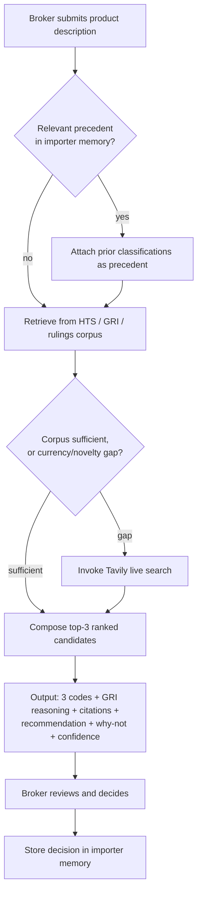
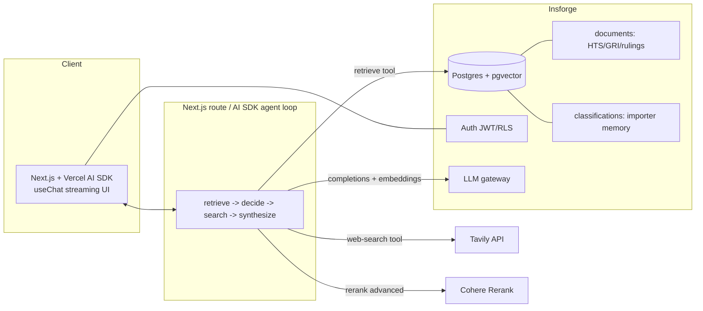

# ClearClass - Plan

## Goal Capsule

- **Objective:** Ship a deployed, browser-based Agentic RAG app that classifies a product description into the top-3 candidate US HTS codes with GRI-based reasoning, citations, and confidence — grounded in an uploaded HTS/GRI/rulings corpus, augmented by live web search, with per-importer memory and an evaluation harness proving quality. Satisfies all 7 AI Makerspace Certification Challenge tasks.
- **Authority hierarchy:** [STRATEGY.md](../../STRATEGY.md) (defensibility wedge) > this plan's Product Contract > Planning Contract. [CHALLENGE.md](../../CHALLENGE.md) defines the graded deliverables. On conflict, the Product Contract wins over implementation convenience.
- **Execution profile:** Solo developer, ~25-hour budget, submission due 2026-07-14. Deploy early (U1) and keep the deployment live.
- **Stop conditions:** Stop and surface a blocker if a decision would change product scope (Product Contract), if Insforge cannot serve a required capability (trigger the raw-Postgres fallback in KTD2), or if corpus ingestion (U2) cannot preserve HTS hierarchy.
- **Product Contract preservation:** Product Contract unchanged — planning added HOW, not WHAT.

---

## Product Contract

### Summary

ClearClass classifies imported products into HTS codes for customs brokers. It returns three ranked candidate codes — each with the interpretation reasoning, source citations, and a recommendation of one over the others — so a broker gets an answer they can *defend*, not just an answer. It is the deliverable for the AI Makerspace Certification Challenge (due 2026-07-14) and must satisfy all seven challenge tasks.

### Problem Frame

Licensed customs brokers must assign every imported product a correct HTS code and duty rate. Classification is judgment-heavy: it requires reconciling dense tariff rules, the General Rules of Interpretation, prior CBP rulings, and specific product attributes. A wrong code causes fines, shipment delays, or over/under-paid duty. Today the work is manual cross-referencing across the tariff schedule and the CROSS rulings database, and the cost of an indefensible call is borne when CBP challenges it. The pain is not speed — it is being right and being able to show why.

### Key Decisions

- **Defensibility is the wedge, not speed.** Every classification is grounded in citable authority (HTS lines, GRI rules, CBP rulings). This rules out a fast-but-opaque black box and shapes the output contract below. (Source: STRATEGY.md.)
- **Output is three ranked candidates with reasoning.** The agent returns the top-3 HTS codes, recommends one, and explains why not the other two — mirroring how a broker defends a choice against competing headings.
- **Corpus = HTS + GRI + ~300 CBP rulings.** Seeded ruling precedent lets answers cite actual CBP decisions. Excludes the eval test-split IDs to prevent leakage.
- **Memory is per-importer classification history.** Surfaces prior classifications as precedent so similar products get consistent codes — consistency is itself a CBP-facing defensibility argument.
- **Eval ground truth comes from real CBP rulings.** The flexifyai CROSS-derived dataset provides labeled product-description to HTS-code pairs; the ATLAS baseline (~40% exact 10-digit, 57.5% 6-digit) sets realistic accuracy expectations.
- **COTS models, no fine-tuning.** Commercial off-the-shelf models via an LLM gateway.

### Actors

- A1. **Customs broker / import compliance specialist** — the primary user; submits a product description and reviews the ranked candidates, making the final call.
- A2. **ClearClass agent** — retrieves from the corpus, decides when to invoke web search, and composes the ranked, cited output.
- A3. **Web-search tool (Tavily)** — supplies current tariff changes, exclusions, and information on novel products absent from the corpus.
- A4. **Corpus vector store** — the uploaded HTS + GRI + seeded-rulings index.
- A5. **Importer memory store** — durable per-importer classification history.

### Requirements

**Data and corpus**

- R1. The uploaded RAG corpus comprises the USITC HTS full export, the GRI text, and ~300 CBP CROSS rulings, chunked, embedded, and indexed in a vector store.
- R2. The seeded rulings exclude the flexifyai eval test-split ruling IDs so retrieval cannot surface an eval item's own answer.
- R3. The agent has a Tavily-backed web-search tool for current tariff changes, exclusions, and products the corpus does not cover.

**Classification behavior**

- R4. Given a product description, the agent returns the top-3 candidate HTS codes, ranked.
- R5. Each candidate carries GRI-based reasoning, citations to its corpus sources (HTS line, GRI rule, or ruling number), and a confidence signal.
- R6. The agent recommends one candidate and states why the other two were not chosen.
- R7. The agent decides per query whether to use the corpus alone or also invoke live web search, and the output shows which sources it consulted.

**Memory**

- R8. The app maintains durable per-importer classification history and surfaces relevant prior classifications as precedent within a new classification.

**Interface and deployment**

- R9. A browser chat interface is usable on both phone and laptop.
- R10. All model calls route through an LLM gateway.
- R11. The app is deployed to a public endpoint.

**Evaluation and improvement**

- R12. An eval harness scores the classifier on the flexifyai 200-row test split: top-1 exact and top-3 recall at both 6- and 10-digit, plus answer groundedness/faithfulness.
- R13. A baseline retriever is implemented and measured before the advanced retriever.
- R14. An advanced retrieval technique plus one additional improvement are implemented, with a before/after comparison table demonstrating measurable lift (Challenge Task 6).

### Key Flows

- F1. **Classify a product.**
  - **Trigger:** A1 submits a product description.
  - **Actors:** A1, A2, A3, A4, A5.
  - **Steps:** Agent checks importer memory (A5) for precedent; retrieves from corpus (A4); decides whether to invoke live search (A3); composes top-3 ranked candidates with reasoning, citations, recommendation, and confidence; presents to A1; on A1's decision, records it to memory.
  - **Covered by:** R3, R4, R5, R6, R7, R8.

- F2. **Precedent recall.**
  - **Trigger:** A new description resembles a product A1 previously classified.
  - **Actors:** A1, A2, A5.
  - **Steps:** Memory surfaces the prior classification; the agent cites it as precedent within the new candidate reasoning.
  - **Covered by:** R8.

### Acceptance Examples

- AE1. **Covers R7.** Given a stable, well-covered product (e.g., a cotton t-shirt), when the agent classifies it, then it answers from the corpus alone and the output lists only corpus citations.
- AE2. **Covers R7.** Given a product implicating a recent trade action (e.g., an item under a 2026 Section 301 change), when the agent classifies it, then it invokes live search and the output shows the web source alongside corpus citations.
- AE3. **Covers R8.** Given a broker who previously classified a similar product for the same importer, when they classify the new product, then the prior classification appears as cited precedent in the reasoning.
- AE4. **Covers R2, R12.** Given an eval run on the 200-row test split, when scoring, then no test-split ruling is present in the retrievable corpus.

### Success Criteria

- The deployed app classifies a pasted product description into top-3 candidates with citations, working in a browser on both phone and laptop.
- The eval harness emits top-1 exact, top-3 recall (6- and 10-digit), and groundedness on the 200-row test set.
- Task 6 shows a measurable retrieval lift in a before/after comparison table.
- A Loom demo (<=10 min) and a written document address all seven challenge tasks.
- Accuracy goal is a working harness plus a measurable improvement over a naive baseline — not state-of-the-art accuracy (ATLAS baseline: ~40% exact 10-digit, 57.5% 6-digit).

### Scope Boundaries

**In scope (v1, by 2026-07-14):** the requirements above — corpus ingest, agentic ranked classification, live search, per-importer memory, browser UI, public deployment, eval harness, and the Task 6 retrieval improvement.

**Outside this product's identity:**

- Fully-automated auto-filing — the human broker stays in the loop by design.
- Non-US or export classification — US import HTS only.

**Deferred for later:**

- The full ~221k CROSS corpus — only the ~300-ruling seed.
- Interactive clarifying-question flow — direct classification only.
- Fine-tuning — COTS models only; ATLAS is a reference baseline, not a component.

### Dependencies / Assumptions

- USITC HTS export and GRI text are public domain and downloadable in one session (verified: `hts.usitc.gov/reststop` REST API).
- The flexifyai CROSS-derived dataset (Apache-2.0, HuggingFace) supplies the labeled eval set; its 200-row test split is the eval ground truth.
- The CBP CROSS API is undocumented but verified live (2026-07-08); the ~300-ruling seed is scraped politely. Fallback if unavailable: non-test rows of the flexifyai dataset serve as the precedent seed.
- Insforge covers Postgres + pgvector + auth + LLM gateway + hosting; developer holds their own LLM provider key and a Tavily key.
- Memory *informs* candidate ranking as precedent; A1 makes the final classification decision.

### Outstanding Questions

**Deferred to planning** *(all resolved — see Key Technical Decisions)*

- Vector store, embedding model, LLM gateway, chunking, advanced retriever, confidence signal, auth/tenant scoping, and secrets handling are resolved in KTD1–KTD11 below.

### Sources / Research

- USITC HTS — REST API and bulk export: `https://hts.usitc.gov` (`/reststop/search`, `/reststop/exportList`). Public domain. ~19k 10-digit lines.
- CBP CROSS rulings — undocumented JSON API at `https://rulings.cbp.gov/api/search`; each record exposes `subject` (product) and `tariff` (assigned HTS). ~221k rulings; no official bulk dump.
- General Rules of Interpretation — USITC HTS front matter (General Notes PDFs); public domain; six short rules plus the Additional US Rules.
- Eval dataset — `flexifyai/cross_rulings_hts_dataset_for_tariffs` (HuggingFace, Apache-2.0): 18,731 rulings, 2,992 unique HTS codes, 200-row test split, product description to gold HTS code.
- Baseline — ATLAS paper (arXiv:2509.18400), fine-tuned 70B model: ~40% exact 10-digit, 57.5% 6-digit on this data.
- Search tool — Tavily (`https://tavily.com`): LLM-oriented search/extract API; free tier 1,000 credits/month.
- Insforge — open-source agent-native BaaS (`https://insforge.dev`, `https://docs.insforge.dev`): Postgres + pgvector, auth (JWT/RLS), storage, edge functions, OpenAI-compatible LLM gateway, hosting; TS SDK `@insforge/sdk`. Free tier: 500 MB DB, $1 model credits, pauses after ~1 week inactivity.
- Eval tooling — `autoevals` (Braintrust, npm): RAGAS-ported LLM-as-judge scorers (Faithfulness, AnswerRelevancy, Context precision/recall) in TypeScript.
- Prior art — Zonos Classify, Avalara Item Classification, 3CE, Descartes (commercial); WCO (authority behind the 6-digit HS layer).

---

## Planning Contract

### Key Technical Decisions

- KTD1. **TypeScript + Next.js (App Router) + Vercel AI SDK for the agent.** The AI SDK's multi-step tool-calling loop (`streamText` with `tools` + `stopWhen`) implements retrieve → decide → Tavily → synthesize, and `useChat` gives a mobile-friendly streaming chat with minimal UI code. Honors the chosen stack and keeps the app in one language.
- KTD2. **Insforge as the single backend, deployed on Vercel.** Postgres + pgvector hold the corpus and per-importer memory; auth (JWT/RLS) isolates importer data; the OpenAI-compatible gateway satisfies R10. The Next.js app (including its API routes) deploys to **Vercel**, which satisfies R11 and hosts the server-side agent loop; Insforge provides data + auth + gateway. Risk: young platform (public late 2025), thin docs, possible API churn — mitigation must cover all five capabilities Insforge provides, not just the database: fall back to raw Postgres (Neon/Supabase) for data/pgvector, **Auth.js (NextAuth)** for auth, and **Vercel AI Gateway** for the LLM gateway (KTD9), each behind the same access layer, so no single Insforge outage blocks R7/R8/R10/R11.
- KTD9. **LLM gateway is provider-agnostic behind one client, verified before ingestion.** Route both completions and embeddings through the Insforge OpenAI-compatible gateway — but before U4, verify the gateway (a) accepts a bring-your-own provider key (not just the $1 credit) and (b) exposes an `embeddings` endpoint, since many OpenAI-compatible gateways proxy chat completions only. If either check fails, point the same client at **Vercel AI Gateway**; R10 is satisfied either way.
- KTD10. **Tenant scope is derived server-side from the verified JWT, never from the client.** The importer key used for every memory read and write comes from verified token claims, not the request body or the UI importer selector. A broker who manages multiple importers is modeled as a server-checked broker→importer membership. This is what makes RLS isolation real; a client-supplied tenant key would be attacker-controlled.
- KTD11. **All model/search/rerank keys are server-only.** LLM, Tavily, and Cohere keys are non-`NEXT_PUBLIC_` env vars read only inside API routes and ingestion scripts; the agent loop, Tavily, Cohere, and embedding calls run server-side only. The Insforge `anonKey` is the only credential permitted in client code. A build-time grep fails the build if a secret name appears in the client bundle.
- KTD3. **Hierarchy-preserving HTS chunking (highest lever on accuracy).** One chunk per HTS leaf line, with the full ancestor path materialized into the chunk text (Section > Chapter > heading > subheading > line) and `chapter`/`heading`/`subheading`/`hts_code` stored as metadata. GRI: one chunk per rule, tagged by rule number. Rulings: one chunk per ruling, `ruling_number`/`hts_code`/`date` as metadata.
- KTD4. **Retrieval: dense baseline vs. hybrid + rerank as the Task-6 improvement, measured at the retrieval layer.** Baseline = dense pgvector cosine top-k. Advanced = hybrid lexical full-text ranking (Postgres `tsvector`/`ts_rank` — true BM25 would need a pg extension, out of scope) + dense fused by Reciprocal Rank Fusion, then Cohere Rerank cross-encoder to top-3. HTS distinctions are lexical-and-subtle, so hybrid+rerank is the expected highest-lift upgrade — but the lift is proven with **retrieval-level recall@k** (does the gold code's chunk reach the LLM), not only end-to-end accuracy, because the LLM synthesis step can mask a retrieval improvement in the final code.
- KTD5. **Eval: TS deterministic accuracy + `autoevals` RAG metrics, retrieval recall as the primary Task-6 signal.** Deterministic scorer over the full 200-row test split: top-1 exact and top-3 recall at 10-digit and 6-digit (matching R12), plus a 4-digit prefix column as extra partial credit. Retrieval `recall@k` (gold code present in retrieved context) is computed for both modes and is the primary before/after comparison for Task 6, since it isolates the retrieval change. RAG-quality metrics (Faithfulness, AnswerRelevancy, Context precision/recall) via `autoevals` LLM-as-judge on a ~40-row subset to bound token spend. Report all suites, baseline vs advanced, and note that n=200 gives roughly a +/-7% confidence interval so a small end-to-end delta may sit within noise.
- KTD6. **Embeddings: `text-embedding-3-small` (1536-dim) via the gateway; we generate and insert.** Insforge stores/searches vectors but does not auto-embed. HNSW index on the vector column.
- KTD7. **Memory: `classifications` table + per-importer vector search.** Columns `importer_id`, `product_description`, `product_embedding`, `chosen_hts`, `confidence`, `reasoning`, `created_at`; RLS-scoped by importer; queried by similarity to inject precedent. Informs ranking; the human decides.
- KTD8. **Leakage guard.** The ~300 seeded rulings exclude every ruling ID present in the flexifyai 200-row test split; enforced at ingestion and asserted in the eval harness (AE4).

### High-Level Technical Design

Ingestion is an offline scripted pipeline (U2–U4) that populates `documents`. The request-time agent loop (U6) reads memory (U7) and corpus (U5/U9), optionally searches the web, and returns structured candidates rendered by the UI (U8). The eval harness (U10) drives the same classification path headlessly against the test split.

### Assumptions and constraints

- **External API keys required:** an LLM provider key, a **Tavily** key, and a **Cohere Rerank** key (U9). All three are server-only env vars in `.env.example` (KTD11); Cohere and Tavily both have free tiers sufficient for the demo.
- **Gateway capability check (before U4):** verify the Insforge gateway accepts a bring-your-own key and exposes an embeddings endpoint (KTD9). If not, use Vercel AI Gateway behind the same client — R10 holds either way and neither depends on the $1 credit.
- **Monitoring (Task 2 infra component):** use the gateway's request logs plus **Langfuse** (TS SDK) for agent tracing/observability, so the Task-2 infrastructure diagram has a named monitoring tool.
- **500 MB free-tier budget is tight, not comfortable.** ~19k HTS leaves at 1536-dim float32 ≈ ~120 MB of vectors before HNSW (~1.5–3x), content text, and the U9 `tsvector`/GIN index — plus GRI and rulings. Pre-compute the budget during U4; if it approaches the cap, drop the embedding to a lower dimension (`text-embedding-3-small` supports a `dimensions` parameter, e.g. 512) or trim the rulings seed before considering the Pro tier.
- Free-tier `$1` model credits are bypassed by using the developer's own key; the ~1-week inactivity pause is handled by a keep-alive ping (see Definition of Done).
- Sequencing is deadline-driven: ingestion/chunking (U2) is the day-1 critical path, and its quality is validated by the U5 retrieval recall@k check before the rest of the stack is built.

---

## Implementation Units

| U-ID | Title | Key files | Depends on |
|------|-------|-----------|------------|
| U1 | Scaffold + Insforge provisioning + deploy skeleton | `app/`, `lib/insforge.ts`, `.env.example` | — |
| U2 | HTS hierarchy-preserving ingestion & chunking | `scripts/ingest-hts.ts`, `lib/chunking.ts` | U1 |
| U3 | GRI + CBP rulings ingestion (leakage-excluded) | `scripts/ingest-gri.ts`, `scripts/ingest-rulings.ts` | U1 |
| U4 | Embedding generation + pgvector load + HNSW | `scripts/embed-load.ts`, `db/schema.sql` | U2, U3 |
| U5 | Baseline dense retriever + retrieval recall@k check | `lib/retrieval/dense.ts`, `lib/tools/retrieve.ts`, `eval/retrieval-recall.ts` | U4 |
| U6 | Agentic classification loop | `app/api/chat/route.ts`, `lib/agent.ts`, `lib/tools/tavily.ts` | U5, U11 |
| U7 | Per-importer memory | `db/schema.sql`, `lib/memory.ts` | U6, U11 |
| U8 | Chat UI (candidates, citations, confidence) | `app/page.tsx`, `components/` | U6, U7, U11 |
| U9 | Advanced retrieval (hybrid + rerank) | `lib/retrieval/hybrid.ts`, `lib/retrieval/rerank.ts` | U5 |
| U10 | Eval harness (accuracy + autoevals) + comparison | `eval/run.ts`, `eval/scorers.ts`, `eval/dataset.ts` | U6, U9 |
| U11 | Authentication + tenant scoping + rate limiting | `lib/auth.ts`, `middleware.ts`, `app/api/chat/route.ts` | U1 |

### U1. Scaffold + Insforge provisioning + deploy skeleton

- **Goal:** A running Next.js app wired to an Insforge project and deployed to a public URL, with the LLM gateway reachable.
- **Requirements:** R10, R11.
- **Dependencies:** none.
- **Files:** `app/layout.tsx`, `app/page.tsx`, `lib/insforge.ts`, `lib/llm.ts`, `.env.example`, `package.json`.
- **Approach:** Create the Next.js App Router app; provision Insforge via `npx @insforge/cli create`; init `@insforge/sdk` client (`baseUrl` + `anonKey`); configure an OpenAI-compatible client pointed at the gateway with the developer's key; deploy the skeleton immediately to establish the public endpoint.
- **Execution note:** Deploy on day 1 and redeploy continuously — do not leave deployment to the end.
- **Test scenarios:** Test expectation: none — scaffolding/config. Verify by runtime smoke: the deployed URL loads on phone and laptop, and a gateway "hello" completion returns.
- **Verification:** Public URL responds; a test completion routes through the gateway.

### U2. HTS hierarchy-preserving ingestion & chunking

- **Goal:** Convert the USITC HTS export into citable, hierarchy-preserving chunks with metadata.
- **Requirements:** R1. Advances KTD3.
- **Dependencies:** U1.
- **Files:** `scripts/ingest-hts.ts`, `lib/chunking.ts`, `scripts/__tests__/chunking.test.ts`.
- **Approach:** Fetch the full schedule via `hts.usitc.gov/reststop/exportList`; walk the `indent` hierarchy; emit one chunk per leaf line whose text carries the full ancestor path; attach `chapter`, `heading`, `subheading`, `hts_code`, `units`, `general_duty` metadata.
- **Execution note:** Build the parser as a standalone tested script first; hand-verify a few known codes (ancestor path + metadata correct) before building anything on top — this is the single biggest accuracy risk.
- **Test scenarios:** Happy path — a known leaf (e.g., `6109.10.0012`) produces a chunk whose text includes its Section/Chapter/heading ancestors and whose metadata `hts_code` matches. Edge — a `superior`/parent row with no duty rate is handled without emitting a duplicate leaf. Edge — an entry with multiple `units` preserves them. Error — a malformed/empty API page fails loudly rather than emitting empty chunks.
- **Verification:** Chunk count is in the expected order of magnitude (~19k leaves); spot-checked codes carry correct ancestry.

### U3. GRI + CBP rulings ingestion (leakage-excluded)

- **Goal:** Ingest the GRI rules and ~300 CBP rulings as citable chunks, excluding eval test-split IDs.
- **Requirements:** R1, R2. Advances KTD8.
- **Dependencies:** U1.
- **Files:** `scripts/ingest-gri.ts`, `scripts/ingest-rulings.ts`, `scripts/__tests__/leakage.test.ts`.
- **Approach:** GRI — one chunk per rule, tagged `{type:'gri', rule}`. Rulings — paginate `rulings.cbp.gov/api/search`, take ~300, store `ruling_number`/`hts_code`/`date` metadata; skip any `ruling_number` in the flexifyai test split. Fallback: if the CROSS API is unavailable, seed from non-test flexifyai rows.
- **Test scenarios:** Covers AE4. Happy path — GRI 1 through the Additional US Rules each become one retrievable chunk tagged by rule. Happy path — ~300 ruling chunks land with `ruling_number` metadata. Error — CROSS API failure triggers the flexifyai-rows fallback. Leakage — assert the intersection of seeded ruling IDs and the test-split IDs is empty.
- **Verification:** GRI and ruling chunks present and tagged; leakage test passes.

### U4. Embedding generation + pgvector load + HNSW

- **Goal:** Embed all corpus chunks and load them into a searchable pgvector table.
- **Requirements:** R1. Advances KTD6.
- **Dependencies:** U2, U3.
- **Files:** `scripts/embed-load.ts`, `db/schema.sql`.
- **Approach:** Create `documents` (`id`, `content`, `embedding vector(1536)`, `type`, `metadata jsonb`); batch-embed chunk text with `text-embedding-3-small` via the gateway; insert; build an HNSW index on `embedding`; add a `tsvector` column + GIN index for U9 hybrid search.
- **Test scenarios:** Happy path — a similarity query for a known product returns its expected HTS line in the top results. Edge — batching handles the full corpus without exceeding rate limits (retry/backoff). Integration — inserted row count equals embedded chunk count (no silent drops).
- **Verification:** `documents` populated; a manual cosine query returns sensible neighbors; DB size within the 500 MB free-tier cap.

### U5. Baseline dense retriever + retrieval recall@k check

- **Goal:** A dense top-k retriever exposed as an agent tool, the Task-6 baseline arm, and an early retrieval-quality signal that validates chunking (U2) before the full agent/UI/eval stack is built on top of it.
- **Requirements:** R13. Supports R4, R5.
- **Dependencies:** U4.
- **Files:** `lib/retrieval/dense.ts`, `lib/tools/retrieve.ts`, `eval/retrieval-recall.ts`.
- **Approach:** Embed the query, run pgvector cosine top-k (via an Insforge `rpc()` search function), return chunks with metadata for citation; wrap as a Vercel AI SDK tool with a typed input/output schema. Add a standalone `retrieval-recall.ts` script that runs the test-split product descriptions straight through dense retrieval (no agent) and reports `recall@k` — whether the gold HTS code's chunk was retrieved.
- **Execution note:** Run the recall@k check as soon as U4 lands, before building U6+. A low baseline recall here means the U2 chunking is defective and must be re-ingested now, while there is still schedule to do it — this is the earliest quantitative signal on the plan's biggest accuracy risk.
- **Test scenarios:** Happy path — a t-shirt query returns chapter-61 chunks in the top-k with citations. Edge — an empty/garbage query returns no results without throwing. Integration — the tool returns citation metadata (`hts_code`, `ruling_number`) the agent can render. Recall — the recall@k script produces a baseline number over the test split and flags it if implausibly low (chunking-defect signal).
- **Verification:** Tool returns ranked, citable chunks; `retrieval-recall.ts` reports a baseline recall@k that confirms chunking is sound before U6 begins.

### U6. Agentic classification loop

- **Goal:** The agent that turns a product description into top-3 ranked, cited, confidence-scored candidates.
- **Requirements:** R3, R4, R5, R6, R7.
- **Dependencies:** U5, U11.
- **Files:** `app/api/chat/route.ts`, `lib/agent.ts`, `lib/tools/tavily.ts`, `lib/schema.ts`.
- **Approach:** `streamText` multi-step loop with the retrieve tool (U5) and a Tavily web-search tool; system prompt instructs GRI-based reasoning and when to search live (currency/novelty gap); enforce a structured output of 3 ranked candidates, each `{ hts_code, reasoning, citations[], confidence }`, plus a recommendation and why-not for the other two, and a `sources_used` marker. The entire loop, including all model, Tavily, and Cohere calls, runs server-side in the API route (KTD11); Tavily results are treated as untrusted input, kept clearly delimited in the prompt, and citations are constrained to real retrieved chunk IDs so injected web content cannot fabricate a code.
- **Test scenarios:** Covers AE1 — well-covered product classifies from corpus only; `sources_used` lists corpus only. Covers AE2 — a recent-trade-action product triggers Tavily; output shows the web source. Happy path — output always contains exactly 3 candidates with citations and confidence. Error — a downstream tool failure degrades gracefully (partial answer flagged, not a crash). Integration — citations reference real retrieved chunk IDs, not fabricated codes.
- **Verification:** Representative descriptions yield 3 defensible candidates with correct source attribution.

### U7. Per-importer memory

- **Goal:** Durable per-importer classification history that surfaces precedent and stays isolated per user.
- **Requirements:** R8.
- **Dependencies:** U6, U11.
- **Files:** `db/schema.sql` (add `classifications`), `lib/memory.ts`.
- **Approach:** Add the `classifications` table (KTD7) with RLS keyed to the JWT importer; the importer key is read from the verified session token, never from the request body or UI selector (KTD10); before classification, similarity-search this importer's history and inject top matches as precedent into the agent context; after the broker decides, persist the decision.
- **Test scenarios:** Covers AE3 — a prior similar classification for the same importer appears as cited precedent. Happy path — a decision persists and is retrievable next session. Edge — a new importer with empty history classifies normally (no precedent). Integration — RLS prevents importer A from reading importer B's history.
- **Verification:** Precedent appears for repeat products; cross-importer isolation holds.

### U8. Chat UI (candidates, citations, confidence)

- **Goal:** A mobile- and laptop-friendly chat interface rendering the structured classification output.
- **Requirements:** R4, R5, R9.
- **Dependencies:** U6, U7, U11.
- **Files:** `app/page.tsx`, `components/CandidateCard.tsx`, `components/Citation.tsx`, `components/ImporterSelector.tsx`.
- **Approach:** `useChat` streaming; render the 3 candidates as cards showing code, confidence, reasoning, expandable citations, and the recommendation/why-not; responsive layout verified at phone width. The importer selector only picks among importers the authenticated broker is a verified member of; the effective tenant key is still resolved server-side from the token (KTD10), so the selector is a convenience, not the security boundary.
- **Test scenarios:** Happy path — submitting a description streams and renders 3 candidate cards with citations. Edge — long reasoning and many citations remain readable on a 375px viewport. Integration — selecting an importer scopes the memory precedent shown.
- **Verification:** Usable on phone and laptop; candidates, citations, and confidence render correctly.

### U9. Advanced retrieval (hybrid + rerank)

- **Goal:** The Task-6 advanced retriever, switchable against the baseline for measurement.
- **Requirements:** R14. Extends R13.
- **Dependencies:** U5.
- **Files:** `lib/retrieval/hybrid.ts`, `lib/retrieval/rerank.ts`, `lib/retrieval/index.ts`.
- **Approach:** Hybrid BM25 (`ts_rank`) + dense fused by Reciprocal Rank Fusion over a top-20–30 candidate set, then Cohere Rerank cross-encoder to top-3; a config flag selects `dense` (baseline) vs `hybrid+rerank` (advanced) so the eval harness can run both against identical inputs.
- **Test scenarios:** Happy path — for a query where an exact material keyword matters (e.g., "of cotton"), hybrid+rerank ranks the correct subheading above dense-only. Edge — reranker API failure falls back to fused-hybrid order without crashing. Integration — the retrieval mode flag changes results deterministically for the same query.
- **Verification:** Both modes runnable on the same inputs; advanced mode reorders as expected.

### U10. Eval harness (accuracy + autoevals) + comparison

- **Goal:** Prove classification quality and demonstrate a measurable retrieval lift (Tasks 5 and 6).
- **Requirements:** R12, R13, R14.
- **Dependencies:** U6, U9.
- **Files:** `eval/run.ts`, `eval/scorers.ts`, `eval/dataset.ts`, `eval/report.md`.
- **Approach:** Load the flexifyai 200-row test split; run the path in `dense` then `hybrid+rerank` mode. Report three suites: (1) **retrieval `recall@k`** for both modes — the primary, cleanest Task-6 before/after signal (reuses `eval/retrieval-recall.ts` from U5), since it isolates the retrieval change from LLM synthesis; (2) deterministic end-to-end accuracy on all 200 — top-1 exact and top-3 recall at 10-digit and 6-digit (R12), plus a 4-digit prefix column; (3) `autoevals` RAG metrics (Faithfulness, AnswerRelevancy, Context precision/recall) on a ~40-row subset. Emit a baseline-vs-advanced comparison table.
- **Execution note:** Lead the Task-6 claim with the retrieval recall@k delta, not end-to-end accuracy — the LLM step can mask a real retrieval gain in the final code. Note in the report that n=200 gives ~+/-7% CI, so a small end-to-end delta may be within noise even when recall@k clearly improves. Cap the LLM-judged RAG metrics to the subset; keep the deterministic scorer separate and fast.
- **Test scenarios:** Covers AE4 — the harness asserts no test-split ruling is in the retrievable corpus before scoring. Happy path — the run produces accuracy numbers for both modes and a comparison table. Edge — a per-row classification error is recorded and skipped, not fatal to the run. Integration — advanced-mode top-3 recall is reported against baseline in the same table.
- **Verification:** `eval/report.md` contains both suites and a baseline-vs-advanced table showing the lift.

### U11. Authentication + tenant scoping + rate limiting

- **Goal:** A logged-in principal whose verified token drives RLS, so per-importer memory is actually isolated and the public endpoint is not an open cost-drain.
- **Requirements:** Mechanizes R8 (the isolation R8 already requires); protects R11.
- **Dependencies:** U1.
- **Files:** `lib/auth.ts`, `middleware.ts`, `app/api/chat/route.ts`.
- **Approach:** Wire Insforge auth (signup/login) so requests carry a verified JWT; resolve the importer/tenant key server-side from token claims (KTD10); gate `/api/chat` so no billable model/search/rerank call runs for an unauthenticated request; add per-user/per-IP rate limiting in `middleware.ts`; set spend caps / budget alerts on the LLM, Tavily, and Cohere keys as a backstop.
- **Execution note:** Land this before U6/U7/U8 depend on it — RLS keyed to a JWT that no unit issues enforces nothing.
- **Test scenarios:** Happy path — an authenticated broker classifies and their decision persists under their importer. Error — an unauthenticated request to `/api/chat` and a direct read of `classifications` are both rejected before any billable call. Integration — importer A cannot read or write importer B's rows by changing the client importer selection (server-derived tenant key). Edge — a broker with membership in two importers can switch between only those two.
- **Verification:** Unauthenticated access is refused; cross-importer isolation holds under a manipulated client request; no model call fires without a session.

---

## Verification Contract

| Gate | Command | Applies to | Done signal |
|------|---------|------------|-------------|
| Type check | `npx tsc --noEmit` | all | No type errors |
| Unit/integration tests | `npm test` (Vitest) | U2, U3, U5, U6, U7, U9, U11 | All scenarios above pass |
| Corpus sanity | `npm run ingest` then manual spot-check | U2–U4 | ~19k HTS leaves; known codes carry correct ancestry; leakage test green |
| Retrieval recall gate | `npm run eval:recall` | U5 | Baseline recall@k reported; not implausibly low (chunking sound) before U6 begins |
| Auth/isolation gate | `npm test` (auth suite) | U11 | Unauthenticated `/api/chat` and `classifications` reads rejected; cross-importer access blocked |
| Eval run | `npm run eval` | U10 | `eval/report.md` with retrieval recall@k + accuracy + RAG metrics + baseline-vs-advanced table |
| Build + deploy smoke | `npm run build` + load public URL on phone and laptop | U1, U8 | App classifies a pasted description end-to-end; no secret name in the client bundle |

---

## Definition of Done

**Global**

- All requirements R1–R14 are met and traced to a unit.
- The app is deployed to a public endpoint (R11) and classifies a pasted description into top-3 cited candidates on both phone and laptop (R9).
- Authentication is enforced: unauthenticated requests get no billable call, and per-importer memory is isolated by a server-derived tenant key (U11).
- `eval/report.md` reports the Task-6 lift primarily as retrieval recall@k (baseline vs advanced), plus top-1/top-3 accuracy (6- and 10-digit) and RAG metrics, with the n=200 confidence caveat noted (R12–R14).
- The leakage assertion (AE4) passes.
- A monitoring tool (gateway logs + Langfuse) is wired and named in the Task-2 infrastructure diagram.
- Loom demo (<=10 min) recorded and a written document addresses all seven challenge tasks.
- Abandoned/experimental code from approaches that did not pan out is removed from the diff.
- An automated keep-alive (scheduled ping) prevents the free-tier project pausing during the submission/judging window, and wake latency was verified against a live demo — not left to a manual pre-demo ping.

**Per unit:** each unit's Verification line is satisfied and its test scenarios pass.

---

## Risks & Dependencies

- **Insforge maturity spans five capabilities, not one (young platform, thin docs, possible churn).** Insforge is load-bearing for data, pgvector, auth, the LLM gateway, and hosting — a Postgres-only fallback covers just two. Mitigation: keep access behind `lib/insforge.ts`/`lib/auth.ts`/`lib/llm.ts` and pre-identify the per-capability fallback — raw Postgres (Neon/Supabase) for data, Auth.js for auth, Vercel AI Gateway for the gateway, Vercel for hosting (KTD2, KTD9).
- **500 MB free-tier DB cap is likely to be hit, not just monitored.** ~19k 1536-dim vectors + HNSW + content text + `tsvector`/GIN plausibly reach the cap before rulings. Mitigation: budget it during U4; if approaching, lower the embedding dimension (`dimensions` param) or trim the seed before paying for Pro.
- **HTS chunking is the day-1 critical path (U2), and its quality is now measured early (U5).** Mitigation: tested standalone parser + hand-verified samples, then the U5 retrieval recall@k check validates chunking *before* U6+ are built on top of it — so a chunking defect is caught while there is still schedule to re-ingest.
- **Task-6 lift may not appear in end-to-end accuracy, and n=200 is noisy.** A retrieval gain can be masked by the LLM step, and a small end-to-end delta sits within a ~+/-7% CI. Mitigation: measure and report the lift at the retrieval layer (recall@k), where the change is isolated (KTD5, U10).
- **CROSS fallback silently weakens the defensibility wedge.** If the fallback fires, flexifyai rows are description→code pairs, not full ruling texts, so citations lose interpretive substance. Mitigation: prefer even a smaller seed of real ruling texts over the pairs-only fallback, and flag the degradation in the write-up if it fires (U3, KTD8).
- **RAG-metric eval token spend.** Mitigation: cap `autoevals` judging to ~40 rows; keep deterministic accuracy on all 200.
- **Free-tier inactivity pause may coincide with judging.** Mitigation: an automated scheduled keep-alive (not a manual pre-demo ping) plus verified wake latency (Definition of Done).
- **Deadline (2026-07-14).** Mitigation: sequencing front-loads ingestion and deploys early; eval and advanced retrieval are the last, independently droppable-to-minimum units.
